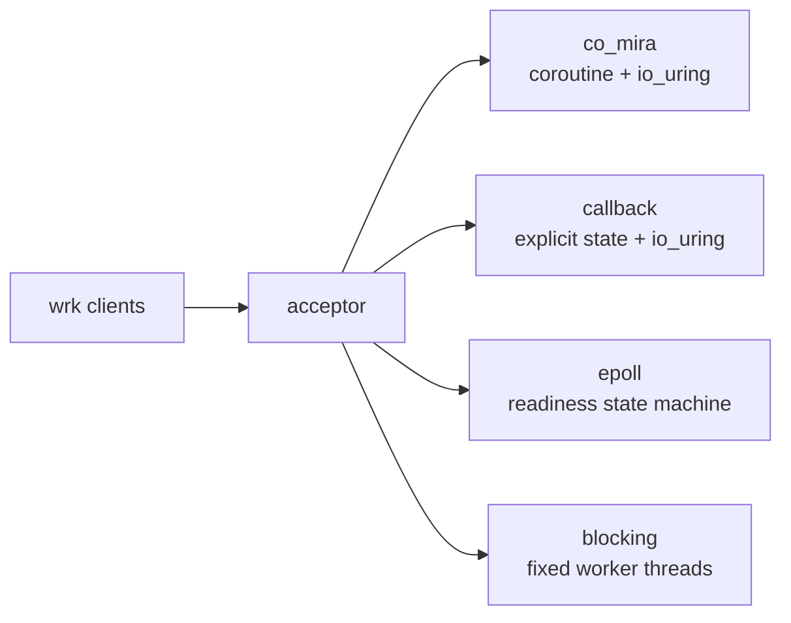
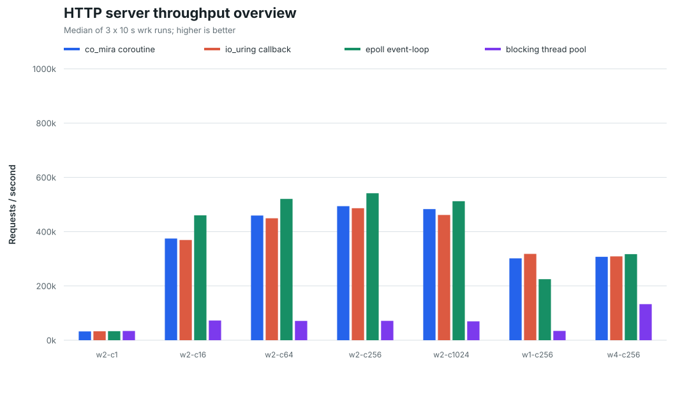
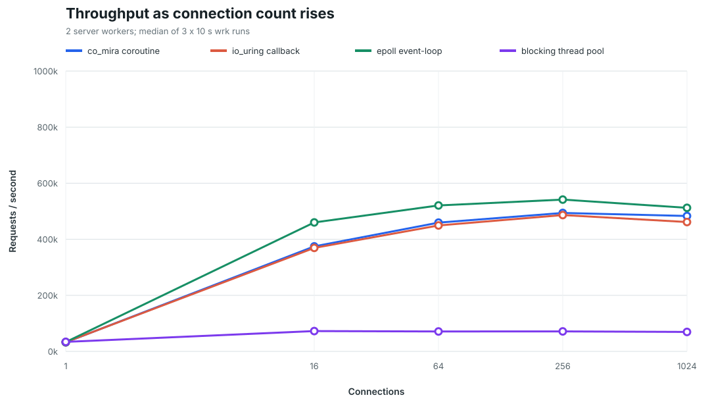
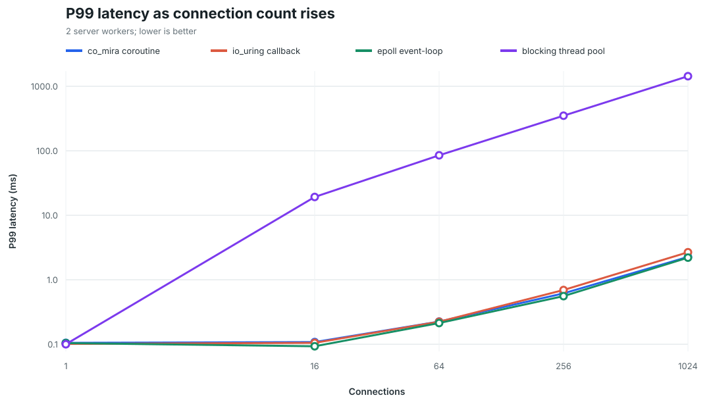
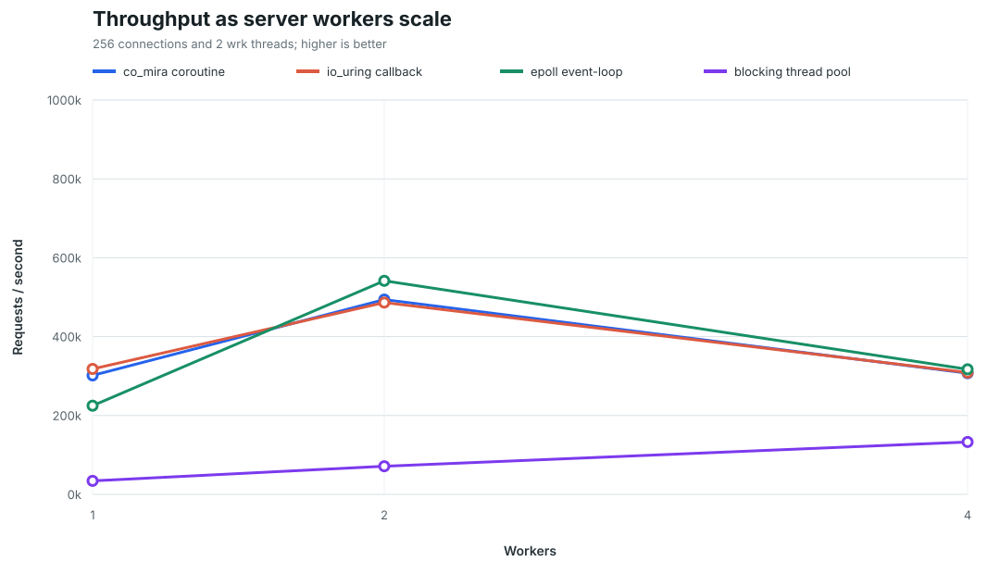
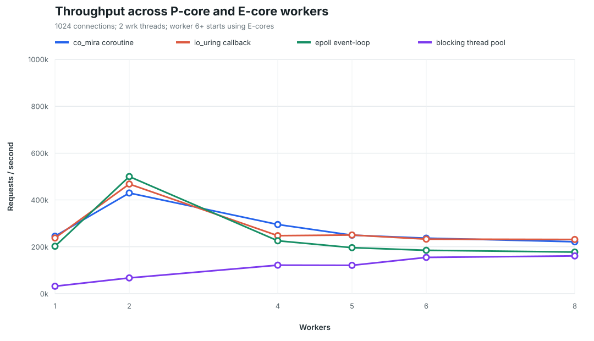
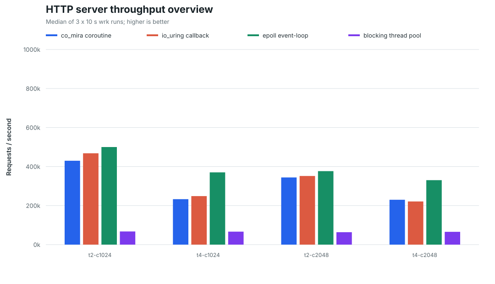

# HTTP server execution-model benchmark

这个 benchmark 比较四种常见的 C++ HTTP 连接执行模型。四个 server
处理相同的 `/benchmark` 请求、返回相同的 3-byte body，并使用相同的
acceptor + worker 线程预算。这里测的是连接调度、系统调用和状态机开销，
不是完整 Web 框架的功能排名。

## Implementations

| Name | Source | Kernel interface | Connection execution model |
|---|---|---|---|
| `co_mira coroutine` | [`example/http_server/main.cc`](../../example/http_server/main.cc) | `io_uring` | 每个连接一个 coroutine，由 `scheduler` 恢复 |
| `io_uring callback` | [`example/callback_http_server/main.cc`](../../example/callback_http_server/main.cc) | `io_uring` | 显式 callback 状态机，一次完成一个 recv/send |
| `epoll event-loop` | [`example/epoll_http_server/main.cc`](../../example/epoll_http_server/main.cc) | `epoll` + nonblocking socket | `EPOLLET` readiness 状态机，一直处理到 `EAGAIN` |
| `blocking thread pool` | [`example/thread_http_server/main.cc`](../../example/thread_http_server/main.cc) | blocking `recv/send` | 一个连接持续占用一个固定 worker thread |

前三种异步实现都是一个 acceptor 加 N 个 worker event-loop。acceptor
round-robin 分发连接：两个 `io_uring` 实现使用 `IORING_OP_MSG_RING`，
epoll 实现使用 `eventfd` 唤醒目标 worker。blocking 基线也是一个 acceptor
加 N 个 worker，但连接没有完成之前 worker 无法服务其他连接。



## Benchmark protocol

wrk 发出的核心请求是：

```http
GET /benchmark HTTP/1.1
Host: 127.0.0.1
```

成功响应为：

```http
HTTP/1.1 200 OK
Server: co_mira
Content-Type: text/plain; charset=utf-8
Content-Length: 3
Connection: keep-alive
Cache-Control: no-store
X-Content-Type-Options: nosniff
Referrer-Policy: no-referrer
Content-Security-Policy: default-src 'self'; script-src 'self'; style-src 'self'; connect-src 'self'

OK
```

统一的 benchmark contract：

- 接受 HTTP/1.0 和 HTTP/1.1 request line。
- 支持 `GET` 和 `HEAD`，其他 method 返回 `405`。
- `/benchmark?...` 的 query 不参与路由。
- 请求 header 上限为 16 KiB。
- benchmark workload 不发送请求 body，也不使用 chunked transfer encoding。
- HTTP/1.1 默认 keep-alive，HTTP/1.0 默认 close。
- 每条连接最多处理 100 个请求，随后响应 `Connection: close`。
- response body 固定为 `OK\n`，HEAD 只返回 header。
- socket 启用 `TCP_NODELAY`。
- 本轮 wrk 不启用 HTTP pipelining、TLS、压缩或 HTTP/2。

coroutine、callback 和 epoll 使用同一语义的完整 header parser；callback
与 epoll 的 benchmark parser 直接按 coroutine 版本实现。blocking
基线使用 `string_view` 版本，但通过相同的 method、target、keep-alive
和 response 协议测试。这个差异对 blocking 基线更有利，因此不会人为
抬高异步实现的成绩。

## Build and test

```bash
cmake -S . -B build-benchmark \
  -DCMAKE_BUILD_TYPE=Release \
  -DBUILD_TESTING=ON

cmake --build build-benchmark -j"$(nproc)" --target \
  co_http_server \
  callback_http_server \
  epoll_http_server \
  thread_http_server

ctest --test-dir build-benchmark -R http_server --output-on-failure
```

单个测试点：

```bash
WORKERS=2 \
THREADS=2 \
CONNECTIONS=64 \
SERVER_CPUS=0,2,4 \
CLIENT_CPUS=10,12 \
RUNS=5 \
WARMUP=5s \
DURATION=15s \
./benchmark/http_server/benchmark.sh
```

完整矩阵：

```bash
./benchmark/http_server/benchmark_matrix.sh
```

生成 CSV 和 SVG：

```bash
python3 benchmark/http_server/summarize.py \
  benchmark-results/four-way-matrix-v2 \
  --output benchmark/http_server/results
```

## Methodology

测试环境：

| Item | Value |
|---|---|
| CPU | Intel Core i9-14900KF |
| OS | WSL2 |
| Kernel | `6.18.33.2-microsoft-standard-WSL2` |
| Compiler | GCC `15.2.0` |
| liburing | `2.14-1` |
| Load generator | wrk `4.1.0`, epoll backend |
| Build | CMake `Release`, `-O3`, `NDEBUG` |

每个测试点先预热 3 秒，再运行 3 次 10 秒采样，表格和图使用三次采样的
中位数。测试顺序按 case 交替正序和反序，降低温度和先后顺序偏差。

CPU affinity：

- 1 worker server：`0,2`
- 2 worker server：`0,2,4`
- 4 worker server：`0,2,4,6,8`
- wrk：`10,12`

server 和 wrk 使用互不重叠的 CPU affinity set。`w2-c1` 使用一个 wrk
thread，其余 case 使用两个 wrk thread。所有 84 次正式采样均未报告
socket error。

## Current send-path optimization

下面这组是后续针对 `t2-c1024` 做的 5 轮交错复测，每轮预热后采样 8 秒，
仍然使用 2 个 server worker。当前 coroutine 和 callback 实现都用一次
`sendmsg`、两个 `iovec` 发送 header 与 body，并正确处理 partial send。

| Implementation | Before | Current | Change |
|---|---:|---:|---:|
| `co_mira coroutine` | 480,191 req/s | 566,577 req/s | +18.0% |
| `io_uring callback` | 482,664 req/s | 566,098 req/s | +17.3% |

`scheduler` 和当前 callback server 的 front/worker ring 都启用了 Linux
5.19 可用的
`IORING_SETUP_COOP_TASKRUN | IORING_SETUP_TASKRUN_FLAG`。单独测试 setup flags
时，默认 flags 的中位数为 476,861 req/s，启用 cooperative task running 后为
520,860 req/s，提升约 9.2%。`IORING_SETUP_SINGLE_ISSUER` 在这台机器上的额外
收益只有约 0.7%，因此没有为了它把最低内核要求从 5.19 提高到 6.0。

合并发送后曾进行过一次历史复测；当时 coroutine 使用当前兼容 flags，
callback 仍保持 flags `0`，结果如下：

| Server | Median req/s | P99 |
|---|---:|---:|
| `co_mira coroutine` | **633,964** | **1.64 ms** |
| `io_uring callback` | 556,610 | 1.75 ms |
| `epoll event-loop` | 520,941 | 2.10 ms |

该历史 coroutine 版本在这个极小响应 workload 中比 epoll 高约 21.7%，callback
版本高约 6.8%。5 轮正式样本均未出现 socket error。可用
[`benchmark_setup_flags.sh`](benchmark_setup_flags.sh) 复测不同 setup flags。
因为该历史样本中的 callback 尚未启用相同的 setup flags，上表不能用于判断
coroutine 与 callback 执行模型本身的性能差异；两者都使用 flags `0` 时吞吐基本相同。
当前源码已经统一两条路径的 setup flags；同参数的新结果见根目录
[`README.md`](../../README.md)。
下面的完整矩阵是在这两项优化之前采集的，保留用于展示连接数与 worker 数的
整体变化趋势，不应与上表混作同一版本的绝对性能比较。

## Results

完整机器可读数据见 [`results/results.csv`](results/results.csv)。

### Throughput overview



| Case | co_mira coroutine | io_uring callback | epoll event-loop | blocking pool |
|---|---:|---:|---:|---:|
| `w2-c1` | 32,370 | 32,966 | 33,341 | **33,965** |
| `w2-c16` | 374,665 | 369,308 | **460,171** | 72,600 |
| `w2-c64` | 459,394 | 449,278 | **520,658** | 71,182 |
| `w2-c256` | 493,882 | 486,462 | **541,532** | 71,351 |
| `w2-c1024` | 483,127 | 461,523 | **512,146** | 69,598 |
| `w1-c256` | 301,626 | **318,102** | 224,965 | 34,169 |
| `w4-c256` | 307,280 | 309,019 | **317,190** | 132,843 |

单位为 requests/second，粗体表示该 case 的最高值。

### Connection scaling



两 worker 下，epoll 在 `c16` 到 `c1024` 都是最高吞吐。这个 workload
只有一个很小的 request 和一个 3-byte response；epoll 可以在一次
readiness 事件中连续 `recv/send` 到 `EAGAIN`，因此减少了 completion
和 ring bookkeeping。这个优势不能直接外推到文件 IO、复杂 coroutine
链或需要 io_uring 特有操作的 workload。

co_mira 在高并发下通常比手写 io_uring callback 高约 1.5% 到 4.7%。
这说明本轮测试中 coroutine suspend/resume 不是主要瓶颈，event-loop
的提交、等待和 batching 策略影响更大。

### P99 latency



P99 图使用对数纵轴，因为 blocking pool 在高连接数下会达到数百毫秒到
秒级，否则三种异步实现的曲线会被压在图底。`w2-c256` 的 P99 分别为：

| Server | P99 |
|---|---:|
| epoll event-loop | **0.557 ms** |
| co_mira coroutine | 0.614 ms |
| io_uring callback | 0.692 ms |
| blocking thread pool | 349.2 ms |

blocking pool 的 P50 仍然很低，但大量连接在等待 worker，导致平均延迟和
尾延迟很高。这正是只看平均吞吐或 P50 容易漏掉的问题。

### Worker scaling



在 `c256` 下，三种异步实现都是 2 worker 最快。4 worker 时总 CPU
利用率没有随 worker 数增长，voluntary context switch 却增加到约
340 万次，吞吐反而下降。这里说明的是当前 WSL 调度与 affinity set 下的
sweet spot，不代表 4 worker 在独立物理机或逐线程硬绑定时一定更慢。

blocking pool 从 1 worker 的 34k 增加到 4 worker 的 133k，接近按线程数
扩展；但每个连接仍独占一个线程，面对数百或数千并发连接时需要大量线程
才能避免排队。

## CPU-aware worker scaling

宿主机是 Intel Core i9-14900KF。Windows CPU set 报告 24 个物理核心、32 个逻辑处理器：
8 个 P 核提供 16 个 SMT 线程，另外有 16 个 E 核。为了回答“服务端线程应该开多少”，
额外测试了 `1/2/4/5/6/8` 个 worker，固定 1024 条连接、2 个 wrk 线程，每个点仍取
3 次 10 秒采样的中位数。

```bash
MODE=workers \
RUNS=3 \
WARMUP=3s \
DURATION=10s \
./benchmark/http_server/benchmark_many_core.sh

python3 benchmark/http_server/summarize_many_core.py \
  benchmark-results/many-core-workers-v3 \
  --output benchmark/http_server/results-many-core
```

布局按宿主机拓扑制定：wrk 使用 `12,14`；server front 使用 `0`，worker 先使用
`2,4,6,8,10`，再使用 `16,20,24`。co_mira 还多一个大部分时间在等待的 coordinator，
它放在 `1`。callback、epoll 和 blocking 的实际线程数是 `workers + 1`；co_mira 是
`workers + 2`。

需要注意，WSL2 中 `taskset` 约束的是虚拟 CPU。这个编号布局参考了 Windows
看到的 P/E 拓扑，但 Hyper-V 不承诺它等同于裸机逐线程硬件绑核。因此下面的数据适合
决定当前 WSL 环境的默认值；要做裸机 P/E 核结论，还需要在原生 Linux 上复测。



| Workers | co_mira coroutine | io_uring callback | epoll event-loop | blocking pool |
|---:|---:|---:|---:|---:|
| 1 | 245,652 | 237,897 | 202,490 | 31,828 |
| 2 | **429,902** | **468,011** | **499,925** | 67,458 |
| 4 | 295,341 | 247,686 | 225,754 | 121,829 |
| 5 | 249,880 | 250,491 | 196,500 | 121,236 |
| 6 | 237,084 | 232,919 | 185,151 | 155,019 |
| 8 | 221,606 | 231,566 | 177,677 | **161,307** |

单位是 requests/second。完整数据见
[`results-many-core/results.csv`](results-many-core/results.csv)，P99 曲线见
[`results-many-core/p99-workers.svg`](results-many-core/p99-workers.svg)。

当前这个极轻量 localhost workload 下，三种异步 server 都在 2 workers 达峰。
继续增加 worker 会增加 front 分发、ring/event-loop 协调和缓存通信成本，但没有足够的
单请求计算去摊薄这些开销。blocking pool 到 8 workers 仍在增长，不过其 P99 约为
616 ms；2-worker 异步实现的 P99 为 2.59 到 2.82 ms。`w1` blocking 的三轮测试还出现
wrk timeout，所以不能只看它的吞吐。

因此当前 benchmark 和轻量服务推荐 `WORKERS=2`。如果真实 handler 有明显 CPU 计算，
下一步优先比较 `WORKERS=4` 和 `WORKERS=5`；不要仅因为机器有 32 个逻辑处理器就直接
开到 24 或 32。`WORKERS=6` 及以上应作为单独的混合 P/E 核实验，而不是默认值。
### Increasing wrk load

为了确认 `WORKERS=2` 的峰值不是被 `wrk -t2 -c1024` 限制，又固定 server 为
2 workers，正式比较了 `t2/t4 × c1024/c2048`。每个点仍然是 3 次 10 秒采样的
中位数；增加 wrk 线程时也扩大了不与 server 重叠的客户端 CPU set。

```bash
./benchmark/http_server/benchmark_wrk_scale.sh
```



| wrk | co_mira coroutine | io_uring callback | epoll event-loop | blocking pool |
|---|---:|---:|---:|---:|
| `t2-c1024` | **429,902** | **468,011** | **499,925** | **67,458** |
| `t4-c1024` | 232,937 | 248,700 | 370,257 | 66,387 |
| `t2-c2048` | 344,148 | 351,619 | 376,636 | 63,731 |
| `t4-c2048` | 229,717 | 221,046 | 330,218 | 65,500 |

`-t` 是 wrk 自己的 event-loop 线程数，`-c` 才是总连接数。一个 wrk 线程可以通过
epoll 驱动数百条连接，因此 `-t` 增加不等于 server 收到更多有用并行工作。在这台
同机 WSL2 + loopback 环境中，`t2-c1024` 已经把异步 server 推到甜点区；继续增加
线程会增加 wrk 调度、loopback 网络栈竞争和包处理开销，继续增加连接则主要增加排队。

co_mira 的 P99 从 `t2-c1024` 的 2.82 ms 增加到 `t4-c1024` 的 13.72 ms，
在 `t4-c2048` 达到 27.19 ms。三种异步实现的正式样本都没有 socket error；
blocking 在两个 `c2048` case 的三轮样本中都报告 timeout。完整数据见
[`results-wrk-scale/results.csv`](results-wrk-scale/results.csv)。
## Reading the numbers

- **低并发**：blocking 最简单，`c1` 下最快，四者差距不到 5%。
- **高并发小响应**：epoll 最实用，也在本机达到最高吞吐和最低 P99。
- **io_uring 两种写法**：co_mira 与 callback 很接近，coroutine 没有表现出
  明显抽象税。
- **不要只看一个点**：1、2、4 worker 的排名并不相同，`c1` 和 `c256`
  的结论也不同。
- **不要过度外推**：这是 localhost + WSL + 3-byte response。真实网络、
  TLS、业务计算、磁盘 IO、较大 response 和跨 NUMA 部署都可能改变排名。

原始 wrk 日志默认写到 `benchmark-results/`。该目录不应提交；需要保留的
稳定结果是本目录中的 CSV、README 和 SVG。
